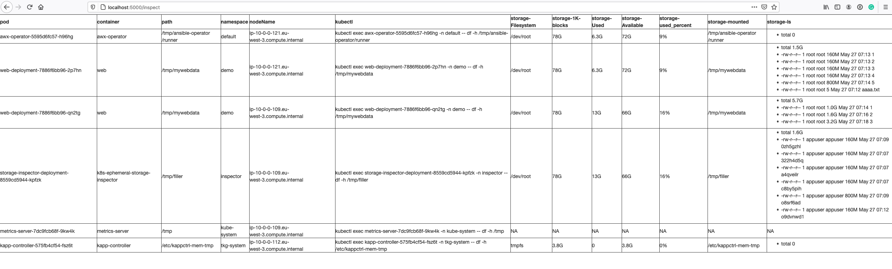
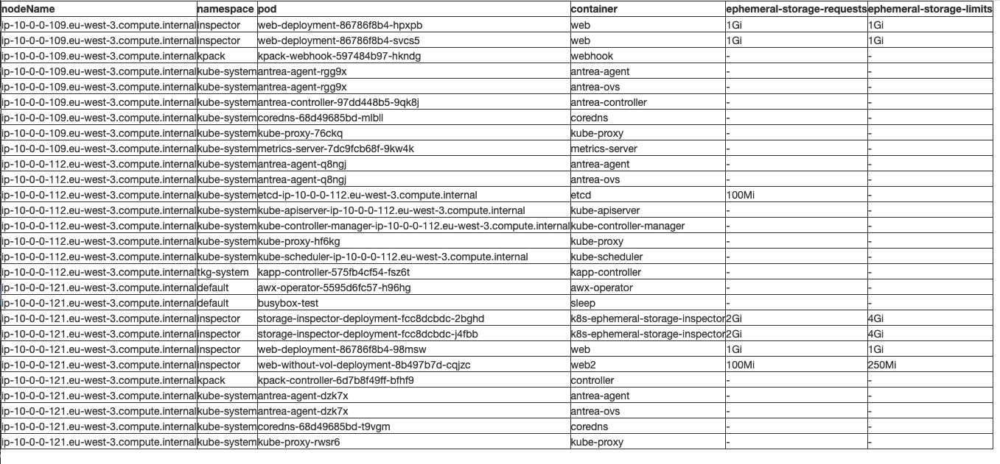

# Deploy

1. Create namespace `inspector` : `kubectl create ns inspector`
2. Deploy `kubectl apply -f https://raw.githubusercontent.com/bmoussaud/k8s-ephemeral-storage-inspector/main/k8s/deploy.yaml -n inspector`
3. Expose: `kubectl -n inspector port-forward service/storage-inspector-svc 5000`
4. Actions

# Test

* Fill: `curl http://localhost:5000/api/fill/5`
* Inspect API `curl http://localhost:5000/api/inspect`
* Inspect GUI [http://localhost:5000/inspect](http://localhost:5000/inspect)
* Ephemeral API `curl http://localhost:5000/api/ephemeral`
* Ephemeral GUI [http://localhost:5000/ephemeral](http://localhost:5000/ephemeral)


# Run



In the screenshot of the app running on my machine 
* GREEN We have 2 worker nodes: p-10-0-0-121.eu-west-3.compute.internal and ip-10-0-0-109.eu-west-3.compute.internal
* RED web-deployment-7886f6bb96-qn2t and storage-inspector-deployment-8559cd5944-kpfzk are sharing the same ephemeral-storage on the node ‘109’ 
* BLUE the pod that is eating the more storage is ‘web-deployment’ with a large file of 3.2G mounted on /tmp/mywebdata.




# Build 
using buildpack https://github.com/GoogleCloudPlatform/buildpacks

````
$make buildpack
````
