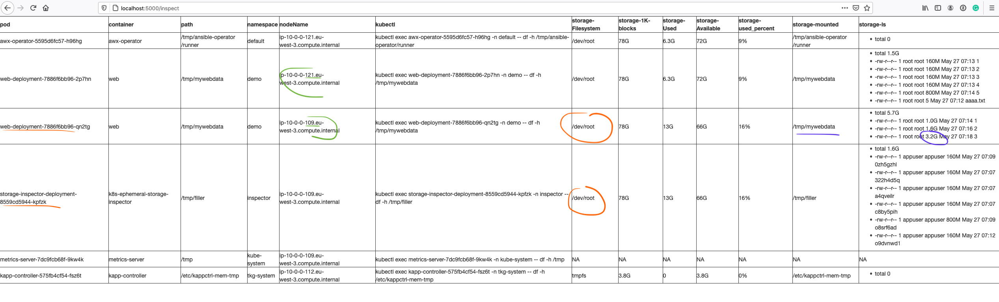

# Deploy

1. Create namespace `inspector` : `kubectl create ns inspector`
2. Deploy `kubectl apply -f https://raw.githubusercontent.com/bmoussaud/k8s-ephemeral-storage-inspector/main/k8s/deploy.yaml -n inspector`
3. Expose: `kubectl -n inspector port-forward service/storage-inspector-svc 5000`
4. Actions

* Fill: `curl http://localhost:5000/api/fill/5`
* Inspect API `curl http://localhost:5000/api/inspect`
* Inspect GUI [http://localhost:5000/inspect](http://localhost:5000/inspect)

